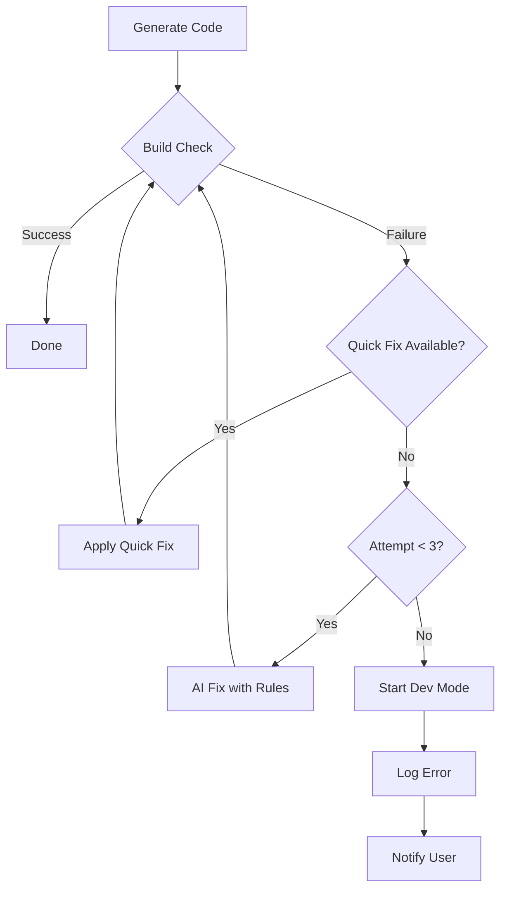

# Error Prevention Strategies

## Current Approach (After Fixes)

### 1. **Prevention First**
- Clear generation rules in prompts
- Consistent export/import patterns
- Explicit 'use client' rules
- Type consistency enforcement

### 2. **Quick Fixes (Non-AI)**
When errors occur, try these first:
- Config file corrections
- PostCSS/Tailwind version handling
- Missing directive additions
- Path corrections

### 3. **AI-Powered Fixes**
If quick fixes fail:
- Use improved prompts that preserve correct code
- Follow same rules as generation
- Maximum 3 attempts to prevent loops

### 4. **Fallback Strategy**
If all fixes fail:
- Start dev server anyway
- Log errors for analysis
- Notify user of manual fixes needed

## Recommended Improvements

### 1. **Error Pattern Learning**
```javascript
// Track which errors occur most frequently
const errorTracker = new ErrorTrackingService();
await errorTracker.logError(projectId, errorMessage, context);

// Use patterns to improve generation prompts
const commonErrors = await errorTracker.getErrorStats();
```

### 2. **Pre-Generation Validation**
```javascript
// Validate requirements before generating
function validateRequirements(userRequest) {
  // Check for ambiguous requests
  // Warn about complex integrations
  // Suggest clarifications
}
```

### 3. **Post-Generation Validation**
```javascript
// Run static analysis before build
async function staticAnalysis(projectPath) {
  // Check import/export matches
  // Verify 'use client' directives
  // Validate type consistency
}
```

### 4. **Incremental Generation**
Instead of generating all at once:
1. Generate core structure
2. Validate it works
3. Add features incrementally
4. Test after each addition

### 5. **Test-Driven Generation**
```javascript
// Generate tests alongside code
function generateWithTests(component) {
  return {
    component: generateComponent(component),
    test: generateComponentTest(component)
  };
}
```

## Error Recovery Workflow



## Common Scenarios & Solutions

### Scenario 1: Missing 'use client'
**Detection**: "React Hook only works in a Client Component"
**Fix**: Add 'use client' to file start
**Prevention**: Check for hooks/events during generation

### Scenario 2: Import/Export Mismatch
**Detection**: "Module has no exported member"
**Fix**: Match import style to export style
**Prevention**: Enforce consistent patterns

### Scenario 3: Type Conflicts
**Detection**: "Type 'X' is not assignable to type 'Y'"
**Fix**: Use centralized type definitions
**Prevention**: Single source of truth for types

### Scenario 4: Tailwind Version
**Detection**: "PostCSS plugin has moved"
**Fix**: Update PostCSS config based on version
**Prevention**: Detect version before configuring

## Best Practices

1. **Log Everything**: Track errors for pattern analysis
2. **Fail Gracefully**: Always provide dev mode fallback
3. **Learn & Improve**: Update prompts based on common errors
4. **Test Locally**: Use test framework before deploying
5. **Clear Feedback**: Show users what's being fixed

## Future Enhancements

1. **ML-Based Error Prediction**
   - Predict likely errors before they occur
   - Suggest preventive measures

2. **Community Error Database**
   - Share common fixes across installations
   - Crowdsourced solutions

3. **Auto-Prompt Improvement**
   - Automatically update prompts based on error patterns
   - A/B test different prompt variations

4. **Rollback Capability**
   - Save working state before fixes
   - Allow reverting if fixes make things worse